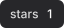
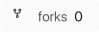

# shieldcn-zig

<p align="center">
  
  
  
  
</p>

<p align="center"><strong>A clean-room, pure-Zig badge engine</strong> with SVG, PNG, and JSON output, six visual variants, and multi-provider support. Built for self-hosting and governed CI/CD.</p>

## Table of Contents

- [Features](#features)
- [Quickstart](#quickstart)
- [Usage](#usage)
- [Providers](#providers)
- [Dagger CI/CD](#dagger-cicd)
- [Architecture](#architecture)
- [Security & Compliance](#security--compliance)
- [License](#license)

## Features

| Feature | Status | Notes |
| ------- | ------ | ----- |
| Core SVG rendering (6 variants) | Done | default, secondary, outline, ghost, destructive, branded |
| Text measurement + layout | Done | heuristic and width-tabled |
| Theme resolution (dark / light) | Done | plus high-contrast, enterprise, custom |
| HTTP server + router | Done | POSIX sockets, single-threaded event loop |
| Query parameter parsing | Done | full `?key=value` set for every badge |
| Static badge provider | Done | `/badge/label-message-color.svg` |
| npm provider | Done | version, downloads, license |
| GitLab provider | Done | stars, forks, issues, merge-requests, pipeline |
| GitHub provider | Done | stars, forks, issues, pulls, release, commits, contributors |
| Egress allowlist | Done | `src/net/egress.zig` |
| Per-provider backoff | Done | `src/cache/backoff.zig` |
| In-memory LRU cache | Done | `src/cache/lru.zig` |
| GitHub token pool + memo store | Done | `src/db/*` |
| Memo badges (GET + PUT) | Done | `/memo/:key` |
| Dagger CI/CD integration | Done | `ci/main.zig` module |
| Multi-arch builds | Done | amd64, aarch64 |
| OCI image | Done | melange + apko |
| Sigstore signing | Done | keyless with GitHub OIDC |
| Structured audit logging | Done | JSON lines to stderr |
| PNG rasterization | Done | pure-Zig, `zigimg` |
| Badge groups | Done | <code>/group/a&#124;b&#124;c.svg</code> |

## Quickstart

```bash
# Build and test
zig build
zig build test

# Run the server
zig build run -- serve
zig build run -- serve --host 0.0.0.0 --port 5335
```

## Usage

### Static badges

```bash
curl http://localhost:5335/badge/build-passing-green.svg
curl http://localhost:5335/badge/build-passing-green.png
curl http://localhost:5335/badge/build-passing-green.json
```

### Live providers

```bash
# npm (version, downloads, license)
curl http://localhost:5335/npm/react.svg?variant=branded
curl http://localhost:5335/npm/downloads/react.svg
curl http://localhost:5335/npm/license/react.svg

# GitHub
curl http://localhost:5335/github/stars/ziglang/zig.svg
curl http://localhost:5335/github/forks/ziglang/zig.svg

# GitLab
curl http://localhost:5335/gitlab/stars/rust-lang/rust.svg
```

### Badge groups

Stack multiple static badges vertically in a single SVG:

```bash
curl "http://localhost:5335/group/build-passing-green|coverage-92%25-blue.svg"
```

### Query parameters

| Param | Values | Default |
| ----- | ------ | ------- |
| `variant` | default, secondary, outline, ghost, destructive, branded | `default` |
| `size` | xs, sm, default, lg | `sm` |
| `mode` | dark, light | `dark` |
| `theme` | dark, light, high-contrast, enterprise, custom | `dark` |
| `font` | inter, geist, geist-mono | `inter` |
| `color` | named or `#hex` | from path |
| `split` | true, false | auto when color present |
| `statusDot` | true, false | `false` |
| `gradient` | color name | none |

## Providers

| Provider | Path | Metrics | Network |
| ---------- | ---- | ------- | ------- |
| `badge` | `/badge/label-message-color.svg` | static | No |
| `npm` | `/npm/:metric/:package.svg` | version, downloads, license | Yes |
| `github` | `/github/:metric/:owner/:repo.svg` | stars, forks, issues, pulls, release, commits, contributors | Yes |
| `gitlab` | `/gitlab/:metric/:owner/:repo.svg` | stars, forks, issues, merge-requests, pipeline | Yes |
| `memo` | `/memo/:key.svg` (GET), `/memo/:key` (PUT) | user-defined | No |
| `group` | <code>/group/spec&#124;spec&#124;...svg</code> | stacked static badges | No |

## Dagger CI/CD

This project ships a Dagger module in `ci/main.zig` using the Dagger Zig SDK.

```bash
# Install Dagger CLI
curl -L https://dl.dagger.io/dagger/install.sh | DAGGER_VERSION=0.21.7 sh

# Run CI locally
dagger call lint
dagger call test
dagger call build export --path=./build-amd64
dagger call build-aarch-64 export --path=./build-aarch64
dagger call container --arch=amd64 export --path=./shieldcn-amd64.tar

# Publish an OCI image
dagger call container --arch=amd64 publish ghcr.io/mchorfa/shieldcn-zig:latest
```

| Function | CLI name | Output | Description |
| ---------- | -------- | ------ | ----------- |
| `build` | `build` | `Directory` | `zig-out` for `x86_64-linux-musl` |
| `buildAarch64` | `build-aarch-64` | `Directory` | `zig-out` for `aarch64-linux-musl` |
| `test` | `test` | `String` | `zig build check` |
| `lint` | `lint` | `String` | alias for `test` (CI symmetry) |
| `container(arch)` | `container --arch=<amd64|aarch64>` | `Container` | runnable Alpine image |

## Architecture

```
src/
  core/        shared types, errors, size presets
  render/      SVG builder, themes, tokens, measurement, PNG rasterizer, group composer
  icons/       embedded developer-icons resolver
  providers/   fetch layer, npm, static, github, gitlab
  server/      HTTP server, router, params, provider registry
  cache/       LRU, backoff
  net/         egress allowlist
  db/          token pool, memo store
  util/        hex colors, number formatting, structured audit logging
```

The server now dispatches providers through a registry (`src/server/providers.zig`). Each provider returns owned `BadgeData`; the HTTP layer resolves themes and renders without holding provider-specific logic. This keeps the handler small and makes adding a new provider a single entry in the registry.

## Security & Compliance

- **Egress allowlist**: `src/net/egress.zig` — only known API hosts permitted.
- **No hardcoded secrets**: `src/providers/fetch.zig` loads tokens from the environment.
- **TLS enforcement**: all provider fetches use `std.http.Client` with redirect handling.
- **Backoff + circuit breaker**: `src/cache/backoff.zig`.
- **Structured audit logging**: `src/util/audit.zig` emits JSON lines to stderr.
- **SLSA Level 3**: Dagger CI + Sigstore signing.
- **SBOM generation**: apko + cosign attest.

## License

MIT
